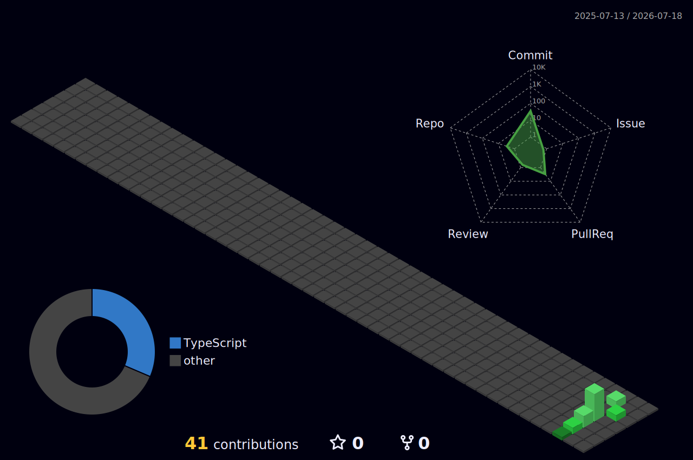

<div align="center">
  <picture>
    <source media="(prefers-color-scheme: dark)" srcset="https://raw.githubusercontent.com/qahassan/qahassan/output/github-contribution-grid-snake-dark.svg">
    
  </picture>
</div>


<p align="center">
  <a href="https://git.io/typing-svg">
    
  </a>
</p>

<p align="center">
  <i>Manual QA / SQA Engineer focused on shipping stable, well-tested releases across fintech, crypto, and marketplace platforms.</i>
  <br>
  <i>Because "hope" is not a testing strategy, and "it works on my machine" is not release criteria.</i>
</p>

<p align="center">
  
</p>


## About Me

- 🔍 **Manual QA / SQA Engineer** based in Lahore Cantt, Pakistan, with **1.5+ years** of hands-on testing experience.
- 💼 Currently working as a **Junior SQA Engineer at FoliumAI**, testing web and mobile applications across four concurrent products.
- 📊 Experienced in **Functional, Regression, Integration, API, and Cross-Platform Testing**, with solid grounding in **SDLC** and **STLC**.
- 🐞 Have diagnosed and tracked **300+ defects** in Jira and verified **100+ API endpoints** across **20+ release cycles**.
- 🤝 Comfortable translating client requirements into clear test cases and collaborating closely with developers through the full defect lifecycle.
- 🌱 Actively expanding into automation — currently building skills in **Selenium, Playwright, Python, and JMeter**.

<!-- New Section: What I Do -->
## 🎯 What I Do

- Design and execute **manual test cases** for web and mobile applications (functional, regression, smoke, sanity, exploratory).
- Perform **API testing** using Postman, Swagger, and Insomnia to validate endpoint behavior, request/response accuracy, and data integrity.
- Log, triage, and track defects through their full lifecycle in **Jira**, writing clear and reproducible bug reports.
- Maintain test coverage and execution tracking in **TestRail**.
- Author **test plans, test strategy documents, and user-flow diagrams** to align engineering, product, and design ahead of releases.
- Work within **Agile/Scrum** teams, participating in sprint planning and release sign-off.


<!-- New Section: QA Quality Gate (updated with realistic metrics) -->
### 🧪 QA Quality Gate Assertion Status
```bash
[PASS] API Endpoint Verification (Postman / Swagger / Insomnia) ... 100+ endpoints
[PASS] Functional & Regression Test Execution ...................... 20+ release cycles
[PASS] Defect Lifecycle Management (Jira) ........................... 300+ defects tracked
[PASS] Cross-Browser & Cross-Platform Validation .................... Web + Mobile
[PASS] Concurrent Project Coverage ................................... 4 active products
------------------------------------------------------------------------------------
STATUS: 200 OK | EXPERIENCE: 1.5+ YEARS | ROLE: MANUAL / SQA ENGINEER
```


<!-- New Section: Testing Expertise -->
## 🧩 Testing Expertise

<p align="left">
  
  
  
  
  
  
  
  
  
  
  
  
</p>

<!-- New Section: QA Workflow -->
## 🔄 QA Workflow (STLC in Practice)

I follow this cycle across every release: analyzing requirements, designing test cases and test data, executing functional/regression/API test passes, logging defects with clear reproduction steps, verifying fixes, and confirming release readiness.


## 🛠️ Technologies & Tools

**QA Tools & Platforms**
<p align="left">
  
  
  
  
  
  
  
  
</p>

**Methodologies**
<p align="left">
  
  
  
  
  
</p>

<!-- New Section: Currently Learning -->
**Currently Learning (Automation Foundations)**
<p align="left">
  
  
  
  
</p>

> 📌 I currently work as a Manual QA Engineer. Selenium, Playwright, Python, and JMeter are part of my ongoing learning path toward test automation — not yet part of my professional toolkit.


<!-- New Section: Certifications -->
## 🎓 Certifications

Currently, I don't hold a formal QA certification. My focus so far has been building strong, hands-on manual and API testing experience across real production releases. I'm evaluating certifications such as **ISTQB Foundation Level** as a next step *(planning stage — not yet started)*.


<!-- New Section: QA Metrics -->
## 📊 QA Metrics (Career to Date)

| Metric | Value |
|---|---|
| Years of Experience | 1.5+ |
| API Endpoints Verified | 100+ |
| Defects Logged & Tracked (Jira) | 300+ |
| Release Cycles Supported | 20+ |
| Concurrent Production Projects (Current Role) | 4 |
| Companies Worked At | 2 |


<!-- New Section: Featured QA Portfolio -->
## 📁 Featured QA Portfolio

| Repository | Description |
|---|---|
| [`test-case-suite`](https://github.com/qahassan) | Sample functional & regression test case documentation |
| [`bug-report-samples`](https://github.com/qahassan) | Clear, reproducible defect reports formatted for Jira |
| [`api-testing-postman`](https://github.com/qahassan) | Postman collections for REST API endpoint validation |
| [`test-plan-templates`](https://github.com/qahassan) | Test strategy & test plan document templates |
| [`requirement-traceability-matrix`](https://github.com/qahassan) | Sample RTM linking requirements to test coverage |
| [`test-summary-reports`](https://github.com/qahassan) | Release readiness & test summary report samples |


## 📁 Key Projects Tested

*   **Foster Ferret** (Web & Mobile App): A multi-functional wellness platform with check-ins, AI chat, Shopify integration, file storage, one-to-one chat, and multi-role dashboards.
    *   *QA Contribution:* Translated client requirements into test cases, ran functional/regression/UI testing across browsers, verified API behavior via Postman, and tracked defects through Jira.
*   **SeedFunds** (Web & Mobile App — FinTech): Fund allocation and vendor-management platform with Stripe payments, AI chat, Google Maps integration, and order tracking.
    *   *QA Contribution:* Authored and executed functional, regression, and integration test cases; validated UI/UX, timelines, and analytics dashboards; conducted API testing via Insomnia.
*   **WZRD Pro** (Web App — Crypto/FinTech): Platform covering admin dashboards, subscription management, user permissions, crypto learning modules, portfolio creation, and rewards.
    *   *QA Contribution:* Built functional/regression/integration test cases, verified security controls and data integrity, and performed API testing via Insomnia.
*   **ShareMundo** (Web & Mobile App): Content-sharing social platform.
    *   *QA Contribution:* Delivered manual QA coverage as one of four concurrent products supported during my current role at FoliumAI.
*   **Prior Projects (Kreatorz.co Internship):** Provided manual QA coverage for a ride-share application, the **Ryvato** iOS app, and an attendance management system — building core functional/regression testing and defect-management skills.


<!-- New Section: Professional Highlights -->
## 🏆 Professional Highlights

- Verified **100+ API endpoints** for functionality, response accuracy, and data integrity using Postman, Swagger, and Insomnia.
- Delivered manual QA coverage across **four concurrent production projects** in a single Agile team.
- Diagnosed and tracked **300+ defects** through the full lifecycle in Jira, working closely with developers to reduce reopen rates.
- Authored **test strategy documents and user-flow diagrams** that aligned engineering, product, and design teams before releases.
- Supported **20+ release cycles** with consistent, on-schedule, defect-minimized delivery.


<h3 align="center">GitHub Stats</h3>

<p align="center">
  
</p>


<!-- New Section: Recruiter-Focused Ending -->
<h2 align="center">🤝 Let's Connect</h2>

<p align="center">
  I'm actively seeking <b>Manual / SQA Engineer</b> opportunities where I can contribute to shipping reliable, well-tested software.<br>
  Open to discussing full-time roles, QA process improvements, and API/functional testing challenges.
</p>

<p align="center">
  <a href="mailto:qa.hassanraza@gmail.com">
    
  </a>
  <a href="https://linkedin.com/in/hassanrazaqa">
    
  </a>
</p>

<p align="center">
  📍 Nadir Abad, Lahore Cantt, Pakistan &nbsp;|&nbsp; 📞 +92 302 0533331
</p>


<p align="center">
  <i>Thanks for stopping by. Always happy to connect, collaborate, and help ship bug-free software.</i>
</p>


> ⭐️ Fact: Testers don't write the software — they make sure it's ready to ship.


<div align="center">
<picture>
    <source media="(prefers-color-scheme: dark)" srcset="./assets/profile-3d-contrib/profile-night-green.svg" />
    
</picture>
</div>


